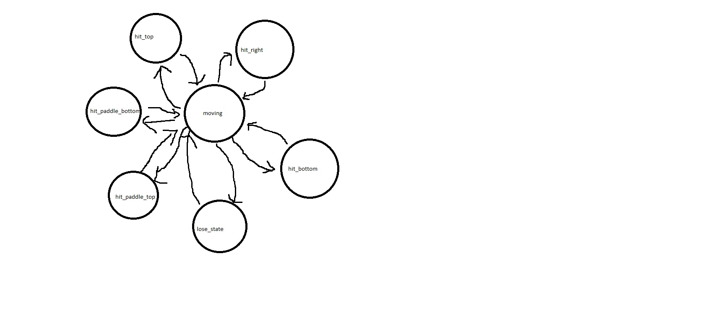

Pong
====

Introduction
============
The purpose of this lab was to use the VGA driver created in lab one to make a simple implementation of the Atari Pong video game. Instead of having two padles this game will have one. The ball will bounce off the top, right, and bottom walls as well as the paddle. The player loses the game if the ball hits the left wall. This will be implemented with a Finite State Machine.

Implementation
==============
The final FSM for `pong_control.vhd` is as follows:



```vhdl
state_next <= state_reg;

if(count_next = 0) then

case state_reg is 
	when moving =>
	if(ball_x_pos - 7 = 0 )then
		state_next <= lose_state;
	end if;
	if(ball_x_pos + 5 = 640 )then
		state_next <= hit_right;
	end if;
	if(ball_y_pos - 5 = 0 )then
		state_next <= hit_top;
	end if;
	if(ball_y_pos + 5 = 480 )then
		state_next <= hit_bottom;
	end if;
	if(ball_x_pos - 5 = 16 and ball_y_pos > (paddle_reg - 50) and ball_y_pos < (paddle_reg) )then
		state_next <= hit_paddle_top;
		end if;
	if(ball_x_pos - 5 = 16 and ball_y_pos >= (paddle_reg ) and ball_y_pos < (paddle_reg + 50) )then
		state_next <= hit_paddle_bottom;
	end if;
	
	when hit_top =>
		
		state_next <= moving;
	when hit_right =>
		
		state_next <= moving;
	when hit_bottom =>
		
		state_next <= moving;
	when hit_paddle_top =>
	
		state_next <= moving;
	when hit_paddle_bottom =>
	
		state_next <= moving;	
	when lose_state=>
		

end case;	
end if;

```

`atlys_lab_video.vhd`
-This is the main top level implementation where `vga_sync.vhd`, `dvid.vhd`, `pixel_gen.vhd` , and `pong_control.vhd` are instantiated. They are all interconnected with signals created here. The component looks like this:

```vhdl
entity atlys_lab_video is
    port ( 
             clk   : in  std_logic; -- 100 MHz
             reset : in  std_logic;
		     up   : in std_logic;
			 down   : in std_logic;
			 spd_switch : in std_logic;
             tmds  : out std_logic_vector(3 downto 0);
             tmdsb : out std_logic_vector(3 downto 0)
         );
			
		
end atlys_lab_video;
```

`vga_sync.vhd`
-This is where v_sync and h_sync are connected to each other. Their main connection is the completed signal. The output blank is high when either vertical or horizontal are blank and v_completed is 1 when v_sync is completed.

```vhdl
entity vga_sync is
    port ( clk         : in  std_logic;
           reset       : in  std_logic;
           h_sync      : out std_logic;
           v_sync      : out std_logic;
           v_completed : out std_logic;
           blank       : out std_logic;
           row         : out unsigned(10 downto 0);
           column      : out unsigned(10 downto 0)
     );
end vga_sync;
```

`h_sync_gen.vhd`
-This generates the horizontal row of synchronization signals. It switches between 5 states: active_video, front_porch, sync_pulse, back_porch, completed. It sets blank low when in active video, h_sync low when in the sync_pulse, and completed high when in completed_state. It contains three flip-flops that govern next state logic, next count logic, and count reseting.

```vhdl
entity h_sync_gen is
    port ( clk       : in  std_logic;
           reset     : in  std_logic;
           h_sync    : out std_logic;
           blank     : out std_logic;
           completed : out std_logic;
           column    : out unsigned(10 downto 0)
     );
end h_sync_gen;
```

`v_sync_gen.vhd`
-This generates the vertical row of synchronization signals. It switches between 5 states: active_video, front_porch, sync_pulse, back_porch, completed. It sets blank low when in active video, h_sync low when in the sync_pulse, and completed high when in completed_state. It contains three flip-flops that govern next state logic, next count logic, and count reseting. It is very similar to h_sync but only operates while h_completed it high. h_sync and v_sync alternate.

```vhdl
entity v_sync_gen is
    port ( clk         : in  std_logic;
           reset       : in std_logic;
			  h_blank     : in std_logic;
           h_completed : in std_logic;
           v_sync      : out std_logic;
           blank       : out std_logic;
           completed   : out std_logic;
           row         : out unsigned(10 downto 0)
     );
end v_sync_gen;
```

`pixel_gen.vhd`
-This signal sets values to r, g and b to display certain colors on the display. The higher the number the brighter the color. This is where the AF logo, paddle, and ball are drawn independently.

```vhdl
entity pixel_gen is
    port ( row      : in unsigned(10 downto 0);
           column   : in unsigned(10 downto 0);
           blank    : in std_logic;
			  ball_x   : in unsigned(10 downto 0);
			  ball_y   : in unsigned(10 downto 0);
		     paddle_y : in unsigned(10 downto 0);	
           r        : out std_logic_vector(7 downto 0);
           g        : out std_logic_vector(7 downto 0);
           b        : out std_logic_vector(7 downto 0));
end pixel_gen;

```

`pong_control.vhd`
this is where all of the logic for the ball and paddle moving in the simplified pong game is located. There are seven states to ball motion: moving, hit_top, hit_right, hit_bottom, hit_paddle_top, hit_paddle_bottom, and lose_state. Every state changes the balls direction in either the x or y direction by changing the modifiers x_dir or y_dir. The paddle moves based on inpus from the buttons and the speed of the ball can be changed with switch seven.

```vhdl
entity pong_control is
  port (
          clk         : in std_logic;
          reset       : in std_logic;
          up          : in std_logic;
          down        : in std_logic;
          v_completed : in std_logic;
			 speed_switch: in std_logic; 
          ball_x      : out unsigned(10 downto 0);
          ball_y      : out unsigned(10 downto 0);
          paddle_y    : out unsigned(10 downto 0)
  );
end pong_control;
```

`Button_logic.vhd`
This handles the debouncing of the buttons with a button state machine that has three states: waiting, press, and depress. It waits in press for 55000 clock cycles before heading to depress. 

```vhdl
entity Button_Logic is
    Port ( clk : in  STD_LOGIC;
           reset : in  STD_LOGIC;
           button_in : in  STD_LOGIC;
           button_out : out  STD_LOGIC);
end Button_Logic;
```

Test/Debug
==========
-The methodology I took in this lab was to get one thing working at a time. First I did the AF logo, then the paddle motion, and then the ball logic. 

- Most of the testing was done by plugging in to the HDMI cable and seeing if what I had made so far worked.

- I ran into a problem with my vga sync. I was not setting v_completed to hi at all and since my ball movement requires that v_completed be high the ball wouldn't move until I did this.

- Another problem I ran into was typos in flip flops. Obviously it wont work if you're setting the wrong signals to zero. 

- Another problem I ran into was in trying to change the reset button to the actual reset button. I just had a blank screen all the time with this so I set it to the middle button.

- I ran into many small syntactical problems that I really solved with brute force. I looked up things in the book
or on the internet or just read the console and tried things.

-I never had an issue with making the ball go behind the AF logo because I drew the parts of the letters as parts of letter not by clomun or row.


Conclusion
==========
From this lab I definitely took away that FPGAs are not good for making sequential games and how hard you have to work at something to make it work. It did however made me appreciate
the versatitlity and capability of the FPGA. Next time I would probably rewrite my code sooner instead of trying to find some small fix all error. Separating state machines definitely helped.


Documentation
=============
C2C Michael Bentley, C2C John Miller, and C2C Ryan Good gave me advice 
on ways they solved the problems they encountered, mainly how to separate state machines for paddle control and ball control.  John showed me that instead of trying to directly add or subtract the balls position in a state machine to use modifiers such as x_dir and y_dir in the actual state machine and use combinational logic later to add or subtract. He also showed me how to debounce buttons with a state machine. Michael and John gave me advice on expanding my congested state machines.Ryan 
showed me that I could use combinational logic to set and change the ball speed quite easily.
All of this advice lead to my completion of the lab and all credit is given to those who had the ideas and contributed them to me.
